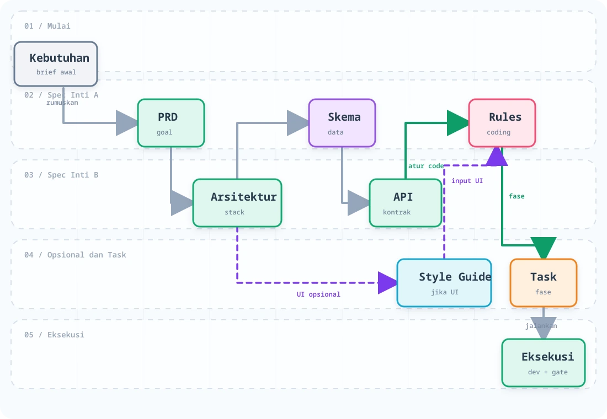

# MACCA — Method

**MACCA** is an AI-based software development system that works from **written specifications**, not guesses. Before a single line of code exists, all important decisions are already documented. AI reads those documents before coding, then verifies the result after coding.

> **Macca** comes from Bugis and means _smart, intelligent, capable_. In Bugis-Makassar philosophy, intelligence is always paired with noble character — a moral identity carried everywhere.


---

## Table of Contents

1. [Problem Solved](#1-problem-solved)
2. [How It Works](#2-how-it-works)
3. [Planning Skills](#3-planning-skills)
4. [Execution Skills](#4-execution-skills)
5. [Utility Skills](#5-utility-skills)
6. [The MACCA AI Team](#6-the-macca-ai-team)
7. [Workflow](#7-workflow)
8. [Installation & Usage](#8-installation--usage)
9. [Configuration](#9-configuration)
10. [Frequently Asked Questions](#10-frequently-asked-questions)
11. [License](#11-license)

---

## 1. Problem Solved

When using AI for coding without clear guidance, these problems are common:

- AI writes code that does not match business needs
- Each AI session seems to "forget" previous project context
- There is no code standard — each file is written in a different style
- It is hard to know when a feature is truly done
- The same bugs appear again and again

**MACCA solves this** by writing all decisions first in spec documents: features, database, API, UI, and code standards. AI reads those documents before coding, then verifies the result after coding.

---

## 2. How It Works

MACCA uses **skills** — structured instructions given to AI to perform specific tasks. Each skill has a clear responsibility and does not overlap.

Skills use progressive disclosure: only names/descriptions are advertised initially, the selected `SKILL.md` loads on demand, and long templates/checklists load only at the phase that needs them. This keeps discovery complete without placing every workflow and output template in context at once.

The full project flow is documented in [Workflow](#7-workflow). `brainstorm-styleguide` is optional and additive; it never replaces `brainstorm-schema`, `brainstorm-api`, or `brainstorm-rules`.

All planning output documents are stored in `project-context/` in your project.

> **Any time:** you can call `help` to see project status and recommended next steps, or `meet` for one structured round of multi-persona input before continuing.

---

## 3. Planning Skills

Planning skills run as evidence-first interview sessions. AI reads applicable upstream specs first and asks only material decisions that are still unknown. At the start of each session, AI announces the topic count, then asks two things if not already saved:

1. **Pacing**: (A) one by one · (B) three at a time · (C) all at once
2. **Recommendations**: should AI provide suggested answers for each question?

These choices are saved and reused. Discovery depth is separate from pacing:

- **quick** — only when you explicitly identify disposable prototype/internal experiment work
- **standard** — default production depth
- **critical** — automatic deeper security, failure, recovery, and operational detail for payments, sensitive/regulated data, multi-tenancy, public uploads/webhooks, privileged administration, or high availability

Depth is inferred from existing context and can be overridden; it does not add a mandatory setup question. Mandatory safety topics are never skipped.

---

<details>
<summary><strong>brainstorm-prd</strong> — Create PRD.md (Product Requirements Document)</summary>

**Persona:** @Galbi — Project Manager

**Called when:** Starting a new project for the first time. If `PRD.md` already exists, AI asks before overwriting it.

**Output:** `project-context/PRD.md`

**Topic count:** 15 topics

**Topics covered:**

1. Project Goal — long-term vision and what makes the project unique
2. Target Users — user personas, demographics, pain points
3. Problem Being Solved — real problem, current workaround, and its cost/limitations
4. Main Features (MVP) — minimum features required in the first version
5. Business Rules — rules that must never be broken (for example: stock cannot go negative)
6. User Flow — happy path, failure scenarios, and degraded behavior
7. Design & Technical Requirements — platform, references, integrations, preferences
8. Non-Functional Requirements — performance, security, scalability, accessibility, availability
9. Success Metrics & Rollout — baseline, target, timeframe, measurement source, owner, launch strategy
10. Acceptance Criteria — concrete conditions for each feature
11. Non-Goals — what will _not_ be built
12. Assumptions — unverified conditions
13. User Stories — prioritized workflows from the user perspective
14. Stakeholders — owners and responsibilities
15. Open Questions — unresolved decisions and risks

**Important behavior:**

- Use `Traceability ID` (`FEAT-*`, `BR-*`, `AC-*`, `NFR-*`, `US-*`) so each requirement can be traced to tasks and code
- Do not overwrite existing files without confirmation

</details>

---

<details>
<summary><strong>brainstorm-architecture</strong> — Create architecture.md (System Architecture)</summary>

**Persona:** @Fachri — Tech Lead

**Called when:** After `PRD.md` is complete. **Required** before `brainstorm-schema` and `brainstorm-api`.

**Read before starting:** `project-context/PRD.md`

**Output:** `project-context/architecture.md`

**Topic count:** 10 topics

**Topics covered:**

1. System Context — systems and external services that interact
2. Tech Stack — frontend, backend, database, hosting, CI/CD, plus strategic dependency/license/health/lock-in/exit evaluation
3. Folder Structure — project file and directory organization
4. Design Patterns — architecture patterns (MVC, Clean Architecture, Feature-based, Hexagonal)
5. Authentication & Authorization — login method, JWT/session, RBAC
6. API Style — REST, GraphQL, or tRPC
7. State Management — Zustand, Redux, Context API, etc.
8. Security & Abuse Cases — required risk screen; depth increases for sensitive systems
9. Deployment & Operations — environments, deployment, observability, owner/runbook, rollback, and critical-system recovery/RPO/RTO
10. Architecture Decision Records — major decisions and their reasoning

**Important behavior:**

- Every decision must be defensible with reasoning
- The `Tech Stack` and `Folder Structure` fields are mandatory references for `spec-compliance` (SC-02) and `developer` (Step 2)

</details>

---

<details>
<summary><strong>brainstorm-schema</strong> — Create schema.md (Database Design)</summary>

**Persona:** @Fachri — Tech Lead

**Called when:** After `architecture.md` is complete.

**Read before starting:** `project-context/PRD.md`, `project-context/architecture.md`

**Output:** `project-context/schema.md`

**Topic count:** 5 topics

**Topics covered:**

1. Persistence Conventions — identity, naming, audit/version metadata, deletion, retention
2. Entity/Storage Map — relational, document, key-value, graph, event-store, or mixed
3. Fields & Data Types — datastore-native validation, PII, volume, growth, payload size
4. Relationships & Placement — references/embedding/edges/aggregates plus tenancy and concurrency
5. Access Patterns & Evolution — indexes/projections, consistency, migration, backfill, compatibility, recovery

**Important behavior:**

- Give each persisted entity a `Traceability ID` (`DATA-*`)
- Datastore-native names, tenancy, concurrency, retention, and migration constraints are verified by `spec-compliance` (SC-03)

</details>

---

<details>
<summary><strong>brainstorm-api</strong> — Create api.md (API Endpoint Contract)</summary>

**Persona:** @Fachri — Tech Lead

**Called when:** After applicable architecture/data decisions, or after architecture for a frontend consumer contract.

**Read before starting:** `project-context/PRD.md`, `project-context/architecture.md`, and `project-context/schema.md` when a provider/full contract needs persisted data details.

**Output:** `project-context/api.md`

**Topic count:** 5 topics

**Topics covered:**

1. Entry Point, Versioning, Deprecation & Auth — protocol-native compatibility and lifecycle
2. Error Catalog — protocol-native errors, retryability, timeout interaction, client action
3. Operations — REST endpoints, GraphQL operations, RPC procedures, events, or mixed contracts
4. Input/Output/Event Details — examples, validation, authorization, idempotency/replay
5. Flow & Reliability — pagination/streaming, rate limits, retries, SLOs, and contract-test invariants

**Important behavior:**

- Give each operation a `Traceability ID` (`API-*`)
- Agreed request and response formats are a **contract** verified by `spec-compliance` (SC-04) during coding

</details>

---

<details>
<summary><strong>brainstorm-styleguide</strong> — Create StyleGuide.md (UI/UX Design Guide)</summary>

**Persona:** @Akram — UI/UX Designer

**Called when:** After `PRD.md` and `architecture.md` are clear. **Optional** — skip if the project has no UI.

**Read before starting:** `project-context/PRD.md`, `project-context/architecture.md`

**Output:** `project-context/StyleGuide.md`

**Topic count:** 8 topics

**Topics covered:**

1. CSS Framework — Tailwind CSS (v3/v4), Bootstrap, CSS Modules, or custom
2. Color Palette — primary, secondary, accent, status colors (error/success/warning/info), dark mode
3. Typography — font family, heading and body sizes, line height, font weight
4. Spacing System — spacing scale used (4px, 8px, 16px, 24px, etc.)
5. Component Styles — button, card, form input, modal, table — styling and states
6. Responsive & Breakpoints — sm/md/lg/xl breakpoints and layout changes
7. Icons & Assets — icon library, image formats, asset naming conventions
8. Accessibility, Localization & Operational States — keyboard/focus/screen reader/reduced motion; loading/empty/error/forbidden/offline; locales/RTL; UI performance

**Important behavior:**

- Agreed colors and spacing are a **contract** — `spec-compliance` (SC-06) flags arbitrary values outside this list

</details>

---

<details>
<summary><strong>brainstorm-rules</strong> — Create rules.md (Code Standards / Code Constitution)</summary>

**Persona:** @Fachri — Tech Lead

**Called when:** Any time, but ideally before coding starts.

**Read before starting:** `project-context/architecture.md`, `project-context/PRD.md`, `project-context/schema.md`, `project-context/api.md`

**Output:** `project-context/rules.md`

**Topic count:** 7 topics

**Topics covered:**

1. AI Persona & Tech Stack — main technologies, preferred libraries, favored and avoided patterns
2. Naming Conventions — variables, functions, components, files, folders, constants
3. Code Style — formatting (Prettier/ESLint), max function length, `console.log` rules, early return
4. Testing Strategy — minimum coverage, testing tools, TDD approach
5. Security Rules — token storage, input validation, secret management
6. Git Workflow — commit message convention, branching strategy
7. `[FORBIDDEN]` Section — list of technical prohibitions that AI **must scan** before writing code

Conditional rules are generated only when applicable: structured logging, migrations, feature flags, generated code, and secret rotation.

**Important behavior:**

- The `[FORBIDDEN]` section is the first thing `developer` reads before coding
- If the `[FORBIDDEN]` section is missing, `spec-compliance` records it as a MINOR finding

</details>

---

<details>
<summary><strong>brainstorm-task</strong> — Create Task.md (Phased Work Plan)</summary>

**Persona:** @Galbi — Project Manager

**Called when:** After all spec documents are complete. Also called automatically by `add-feature` to add a new phase.

**Read before starting:** All documents in `project-context/` (PRD, architecture, schema, api, rules, StyleGuide)

**Output:** `project-context/Task.md`

**User clarification count:** 3 topics plus one automatic document-completeness check

**Clarification topics:**

1. Phase Priority Order — implementation order, which features must finish first
2. Task Granularity — how small should tasks be? One file, one endpoint, or one full feature?
3. Execution Rules — stop for confirmation after each task, or continue automatically by phase?
4. Verify Available Documents — AI checks spec completeness itself before creating `Task.md`

**Two operation modes:**

- **Generate New** — create `Task.md` from scratch based on all available specs
- **Add Phase Mode** — append a new phase below existing `Task.md` content (called by `add-feature`, does not overwrite old content)

**Important behavior:**

- Tasks are **not created from guesses** — all tasks are derived from the spec documents
- Every task has concrete, verifiable `Acceptance Criteria`
- Testing order follows `rules.md`: test-first when explicitly selected, otherwise test-with-change or the project's approved workflow
- Every task has a `Traceability ID` that links it to requirements in the specs
- Every phase receives a Definition of Done derived from applicable specs: validation, security, migration/recovery, observability, docs/rollout, `spec-compliance`, and `code-review`

</details>

---

## 4. Execution Skills

---

<details>
<summary><strong>developer</strong> — Execute tasks from Task.md phase by phase</summary>

**Persona:** @Firdaus — Expert Developer

**Called when:** After `Task.md` exists and is ready to execute.

**Full workflow:**

**Step 0 — Identify name & project**
Read `.agents/developer-config.json`. If `name` or `project` is missing, AI asks once and saves the answer.

**Additional skills & MCP setup** (`references/onboarding.md`)

_Additional Skills:_

- If `additionalSkills` already exists in config → use it directly
- If not → AI asks once: _"Are there any additional skills for this project?"_
- For every named skill, AI **first searches the workspace itself** (`.agents/skills/`, `.github/skills/`, `.opencode/skills/`). It only asks you for the path if the skill is not found.
- When working on a relevant task, AI **must read** `SKILL.md` from that skill before writing code.

_MCP (Model Context Protocol):_

- If `availableMCPs` already exists in config → use it directly
- If not → AI asks once: _"Which MCPs are available in your workspace?"_
- Only listed MCPs will be used.

**Developer scope** (`references/onboarding.md`)

- If `developerPreferences.scope` already exists → use it directly
- If not → AI asks once:
  ```
  What is your work scope in this project?
  A) Frontend only — do not touch backend/API/database
  B) Backend only  — do not touch UI/frontend
  C) Fullstack     — work across the whole stack
  ```
- This scope is enforced in every phase: AI will not create/change files outside the scope.

**Work mode** (`references/onboarding.md`)

- If `developerPreferences.workMode` already exists → use it directly
- If not → AI asks once:
  ```
  A) Code now   — start immediately
  B) Plan first — write a plan first for your review
  ```
- **Plan-first mode:** AI creates a plan file in `project-context/plans/phase-[N]-[slug].md` with a status header at the top. Plan status changes through this lifecycle:
  ```
  status: review      ← when the plan is first created (you review it first)
  status: in-progress ← when you type "start"
  status: code-review ← when all tasks in the phase are complete
  status: done        ← when code-review is complete
  ```

**Selecting relevant specs** (`references/execute-task.md`)

| Condition                   | Read                          |
| --------------------------- | ----------------------------- |
| All tasks (always)          | `rules.md`, `architecture.md` |
| Task touches database/model | + `schema.md`                 |
| Task touches API/endpoint   | + `api.md`                    |
| Task touches UI/component   | + `StyleGuide.md`             |
| Requirement is unclear      | + `PRD.md`                    |

Scope enforcement: if `scope=frontend`, AI does not touch backend files. If `scope=backend`, AI does not touch frontend files.

**Executing tasks** (`references/execute-task.md`)

For each task:

1. Understand the task and acceptance criteria
2. Check the ladder: does it need to be built? Does it already exist in the codebase? Is it in the standard library? (YAGNI)
3. Write an I/O contract for non-trivial functions
4. Follow the testing workflow in `rules.md`: test-first only when selected, otherwise test-with-change or the approved project policy
5. After finishing, write `[SELF-REVIEW]`:
   ```
   1. Security risk: [1 potential issue — or "none identified"]
   2. Performance bottleneck: [1 area — or "none identified"]
   3. Spec assumption: [1 assumption — or "none"]
   ```
6. Run validation, update `Task.md` (`[ ]` → `[x]`)

Developer loads workflow references by state, not all at once:

- `onboarding.md` only for missing setup or plan-first
- `execute-task.md` only for the current task
- `close-phase.md` only when closing a phase/project

**Closing a phase** (`references/close-phase.md`)

1. Show a phase summary
2. Verify the applicable Phase Definition of Done; mark genuine non-applicable items with a reason
3. If there is a plan file for this phase → update plan status: `in-progress` → `code-review`
4. Run `spec-compliance` automatically
5. If clean, run `code-review` automatically
6. Complete quality-gate DoD items, then offer the next phase

**MCPs used (if listed in `availableMCPs`):**

- `context7` or equivalent docs MCP — current installed-version library documentation
- `codebase-memory-mcp` or equivalent graph/symbol tooling — codebase discovery and relationships
- Other registered MCPs only when relevant to the current task

</details>

---

<details>
<summary><strong>quick-dev</strong> — Execute a single focused task directly, without phase ceremony</summary>

**Persona:** @Firdaus — Expert Developer

**Called when:** A small, targeted change is needed (color fix, layout tweak, copy edit, minor logic adjustment) and it still maps cleanly to the current project context. It avoids full phase ceremony, but keeps the same quality gates.

**Not for:** new features, database migrations, new API endpoints, or changes touching more than 5 files — use `developer` instead.

**Full workflow:**

**Step 0 — Identity**
Same as `developer`. Reads `.agents/developer-config.json`, greets by name and project.

**Step 0b & 0c — Additional Skills, MCP, Scope**
Same setup policy as `developer`. Reads from config if already set and asks only for missing required setup.

**Step 1 — Pre-flight summary** _(unique to quick-dev)_

Before any code is written, AI shows:

```
Quick Dev — Pre-flight
───────────────────────
Task   : [concise interpretation]
Specs  : [specs to read]
Files  :
  ~ [path/file]   (modify)
Assumptions (will proceed unless corrected):
  [~] [assumption]
Need confirmation before proceeding:   ← omit if none
  [?] [blocking question]
```

- Non-blocking ambiguities go under "Assumptions", not as questions
- Missing specs (e.g. no `StyleGuide.md` but task touches UI) are flagged here
- Waits only when a blocking ambiguity exists; otherwise proceeds in the same turn with listed assumptions

**Step 2 — Read relevant specs**
Same table as `developer` — reads only what the task needs.

**Step 3 — Execute**
Loads the same task-execution workflow as `developer`: scope check → delta approval if needed → clarify only blocking ambiguity → I/O contract for non-trivial logic → code → `[SELF-REVIEW]` → validate.

**Step 4 — Update Task.md**

| Condition                 | Action                                                             |
| ------------------------- | ------------------------------------------------------------------ |
| Related item found, `[ ]` | Mark `[x]`, add brief note                                         |
| Related item found, `[x]` | Add sub-note about the refinement                                  |
| No related item           | Append to active phase as `[x]` with tag `(quick-fix: YYYY-MM-DD)` |

**Step 5 — Quality gates**
Runs full `spec-compliance` then `code-review`. Both follow `fixMode` from config.

**Important behavior:** quick-dev is a bounded router, not a separate implementation philosophy. It follows the same shared implementation principles, testing policy, and approval gates as `developer`, but only for small, clearly anchored work. Anything broader routes back to `developer`.

**Step 6 — Final report**

```
Quick Dev — Done
─────────────────
Task      : [description]
Files     : [changed files]
Validated : [check and result]
Assumptions used: [~] ...
Remaining ambiguities:   ← omit if none
  [!] ...
```

</details>

---

<details>
<summary><strong>spec-compliance</strong> — Verify code against all spec documents</summary>

**Persona:** @Fachri — Tech Lead

**Called when:** Automatically after each completed phase by `developer`. Runs **before** `code-review`.

**Checklist (8 items):**

| ID    | Aspect                  | Documents Read                                                                               |
| ----- | ----------------------- | -------------------------------------------------------------------------------------------- |
| SC-01 | PRD Compliance          | scope, business rules, acceptance/NFR, metrics/rollout and degraded behavior when applicable |
| SC-02 | Architecture Compliance | stack, boundaries, patterns, auth, observability/rollback/recovery when touched              |
| SC-03 | Schema Compliance       | datastore-native names, validation, tenancy, concurrency, retention and evolution            |
| SC-04 | API Compliance          | protocol-native operations, errors, auth, reliability, lifecycle and contract invariants     |
| SC-05 | Rules Compliance        | `[FORBIDDEN]`, naming, security, testing and applicable operational conventions              |
| SC-06 | StyleGuide Compliance   | tokens, responsive behavior, accessibility, localization and operational states              |
| SC-07 | Task Completion         | acceptance criteria, traceability and applicable Phase Definition of Done                    |
| SC-08 | Scope Compliance        | `developer-config.json` — frontend/backend scope respected, no files outside scope           |

**Severity:** `💥 BLOCKER` → fix now, re-run | `🔴 MAJOR` → fix before the next phase | `⚠️ MINOR` → discuss | `✅ PASS` → continue to `code-review`

**Note:** SC-07 is N/A when run from `bug-fix`.

</details>

---

<details>
<summary><strong>code-review</strong> — Code quality and security review</summary>

**Persona:** @Fachri — Tech Lead

**Called when:** Automatically after `spec-compliance` is clean. Can also be called manually any time.

**Fix mode (runtime default + can be set in config):**

```
A) Report first — show all findings, wait for confirmation before fixing
B) Fix now      — automatically fix BLOCKER/MAJOR, full report at the end
```

If this field is missing, the default is `report-first`. To change it, the user or config workflow can set `codeReviewPreferences.fixMode` in `developer-config.json`.

**Phase 1 — 27-Item Code Quality:**

| Tier       | Item                                                                                                                                                                                                                                                                                                                                                 |
| ---------- | ---------------------------------------------------------------------------------------------------------------------------------------------------------------------------------------------------------------------------------------------------------------------------------------------------------------------------------------------------- |
| 💥 BLOCKER | CR-01 Wrong imports · CR-02 Runtime errors · CR-03 Null/undefined · CR-04 SQL injection · CR-05 Deprecated methods                                                                                                                                                                                                                                   |
| 🔴 MAJOR   | CR-06 Duplicate function · CR-07 Unused code · CR-08 Duplicate logic · CR-09 Obsolete code · CR-10 Inconsistent naming · CR-11 Ignoring existing code · CR-12 Missing dependency · CR-13 Dependency conflict · CR-14 Memory leaks · CR-15 Security ignored · CR-16 Missing required rate-limit handling · CR-17 Missing tests required by `rules.md` |
| ⚠️ MINOR   | CR-18 Edge cases · CR-19 Happy path only · CR-20 Performance · CR-21 Outdated pattern · CR-22 Under-engineering · CR-23 Over-engineering · CR-24 Environment assumptions                                                                                                                                                                             |
| ℹ️ INFO    | CR-25 Missing comments · CR-26 Jargon · CR-27 Comment quality                                                                                                                                                                                                                                                                                        |

**Phase 2 — 10 Security Essentials:**

| ID     | Aspect                                                                                                                                                                                                                                                                                                                                      |
| ------ | ------------------------------------------------------------------------------------------------------------------------------------------------------------------------------------------------------------------------------------------------------------------------------------------------------------------------------------------- |
| SEC-01 | Injection Prevention — SQL, shell, eval                                                                                                                                                                                                                                                                                                     |
| SEC-02 | Authentication — password hashing, cookie attributes                                                                                                                                                                                                                                                                                        |
| SEC-03 | Authorization — deny-by-default, ownership checks, mass assignment                                                                                                                                                                                                                                                                          |
| SEC-04 | XSS Prevention — innerHTML, dangerouslySetInnerHTML                                                                                                                                                                                                                                                                                         |
| SEC-05 | API Security — rate limiting, CORS, JWT verification                                                                                                                                                                                                                                                                                        |
| SEC-06 | Data Protection & Logging — no sensitive logs, no hardcoded secrets                                                                                                                                                                                                                                                                         |
| SEC-07 | Error Handling Security — fail-closed, no swallowed exceptions                                                                                                                                                                                                                                                                              |
| SEC-08 | Input Validation — body/params/query/headers/cookies                                                                                                                                                                                                                                                                                        |
| SEC-09 | Framework-Specific Security — AI reads `architecture.md` to detect the framework: **Next.js** (`NEXT_PUBLIC_*`, Server Actions, middleware, wildcard image domains), **Laravel** (CSRF, Eloquent, `.env`), **Django** (`ALLOWED_HOSTS`, `DEBUG`, `SECRET_KEY`), **Express/NestJS** (`helmet`, CORS, body limits), **Rails** (strong params) |
| SEC-10 | Dependency Vulnerabilities — packages with critical/high CVEs (`npm audit`, `pip audit`, `composer audit`, etc.)                                                                                                                                                                                                                            |

**Format for each finding:** Where? → If not fixed? → If fixed? → Recommended fix

**Update plan after review completes** (if a plan file exists for this phase):

- **Plan-level deviation exists** (wrong library, pattern not followed, scope changed, approach differs from the plan) → add a note to the plan + change status: `code-review` → `done`
- **No plan deviation** (only code quality issues: naming, formatting, security hardening) → change status only: `code-review` → `done`, with no note

</details>

---

## 5. Utility Skills

---

<details>
<summary><strong>help</strong> — Project status dashboard and next-step guidance</summary>

**Persona:** @Galbi — Project Manager

**Called when:** Any time, especially if you are unsure where to start.

**What it checks:**

- Spec documents in `project-context/` — `PRD.md`, `StyleGuide.md`, `architecture.md`, `schema.md`, `api.md`, `rules.md`, `Task.md` (count `[ ]` vs `[x]`)
- Developer config in `.agents/developer-config.json` — `name`, `project`, `scope`, `workMode`, `additionalSkills`, `availableMCPs`
- Plans in `project-context/plans/` — list all plan files and their statuses (`review` / `in-progress` / `code-review` / `done`)

**Output format:**

```
Checking your project now...

Spec Documents
  [✓] PRD.md           — Product requirements
  [✓] architecture.md  — System architecture
  [ ] schema.md        — Not created yet
  ...

Developer Config
  [✓] name: Firdaus
  [✓] scope: fullstack
  [✓] workMode: plan-first
  [✓] additionalSkills: 2 skills
  [ ] availableMCPs: not configured

Plans
  [✓] phase-1-setup.md       (status: done)
  [✓] phase-2-auth.md        (status: in-progress)

Status: [project status summary]
Recommended next steps: ...
```

</details>

---

<details>
<summary><strong>bug-fix</strong> — Diagnose, fix, and document bugs</summary>

**Persona:** @Ikhsan — Debugger

**Called when:** A bug needs to be fixed.

**Workflow:**

1. You describe the bug (symptoms, location, reproduction steps, error message)
2. AI checks `bug-log.md` — has it happened before?
   - **Identical** → apply the same fix (ask for confirmation first)
   - **Similar but different** → diagnose again
   - **New** → continue to diagnosis
3. AI reads the broken file + all callers of shared code — one root-cause fix is better than many guards in each caller
4. AI formulates and explains the root cause → wait for confirmation before fixing
5. Apply the fix → run `spec-compliance` + `code-review`
6. You confirm the bug is resolved
7. AI adds regression prevention (test, rule/spec update)
8. AI records it in `project-context/bug-log.md` ← **only after your confirmation, never automatically**

</details>

---

<details>
<summary><strong>add-feature</strong> — Add a new feature to an existing project</summary>

**Persona:** @Galbi — Project Manager

**Called when:** A new feature needs to be added to an existing project.

**Workflow:**

1. You describe the new feature (name, function, users, reason)
2. AI reads all specs in `project-context/`
3. AI shows an impact analysis — which documents are affected (including `plans/`)
4. You confirm the analysis
5. AI updates **all** affected documents:
   - `PRD.md` → `architecture.md` → `schema.md` → `api.md` → `StyleGuide.md` → `rules.md`
   - `project-context/plans/` — if a plan file exists for an affected phase, add a `## Feature Addition: [name]` section without overwriting old content
6. AI calls `brainstorm-task` (Add Phase Mode) to add new phases and tasks to `Task.md`
7. Continue with `developer`

**Absolute rule:** every affected document must be updated — none may be skipped.

</details>

---

<details>
<summary><strong>spec-audit</strong> — Check consistency across documents</summary>

**Persona:** @Fachri — Tech Lead

**Two modes:**

**Project Mode** — audit `project-context/`
Checks consistency _between_ documents: persisted entities with no supporting operation? Features with no task? PRD metrics with no observability signal? Rollout without rollback? Architecture decisions conflicting with rules? Traceability IDs referenced but missing?

**Framework Mode** — audit MACCA itself
Checks consistency _between_ skill instructions: are README, skill docs, and workflow aligned, or do they conflict?

**What it checks:** direct conflicts → workflow drift → inconsistencies → ambiguities

**Finding format:** Where? → Why is it a problem? → Specific recommended fix + reasoning

</details>

---

<details>
<summary><strong>spec-init</strong> — Generate all specs from an existing codebase</summary>

**Persona:** @Fachri — Tech Lead

**Called when:** The project already exists but has no spec documents yet.

**Two modes:**

```
Mode A — Batch Generate: scan the full codebase, generate everything at once.
Mode B — Guided Generate: one document → you review → confirm → continue.
```

**Generation order:** `architecture.md` → `rules.md` → `schema.md` → `api.md` → `StyleGuide.md` → `PRD.md`

`PRD.md` is created last because it is synthesized from observed behavior, not guessed intent.

**Each generated document includes:**

- **Evidence Inputs** — files/sources used as the basis for each claim
- **Confidence Level** per claim: _High_ (seen directly in code) / _Medium_ (strong inference) / _Low_ (guess, needs verification)
- **Confidence Summary** — summary of strong facts, inferences, and what still needs manual verification
- **Missing Decisions** — choices that cannot be proven from code, with the recommended owning brainstorm skill

</details>

---

<details>
<summary><strong>meet</strong> — Single-round multi-persona team meeting</summary>

**Persona:** @Galbi (facilitator)

**Called when:** Any time you need perspectives from several specialties at once.

**How it works:** Provide agenda, desired outcome, hard constraints, optional evidence, and participants in one setup. In one response, every selected persona gives exactly one evidence/assumption-labeled recommendation in a fixed order. @Galbi then summarizes decisions, open questions, action items, and artifact handoffs before closing automatically. A second round requires a new `meet` invocation.

**Available personas:**

- `@Galbi` — Project Manager: scope, priorities, business impact
- `@Fachri` — Tech Lead: technical decisions, trade-offs, security
- `@Akram` — UI/UX Designer: usability, visual consistency, accessibility
- `@Firdaus` — Developer: feasibility, complexity estimates
- `@Ikhsan` — Debugger: risks, edge cases, potential bugs

</details>

---

<details>
<summary><strong>release-readiness</strong> — Production release evidence gate</summary>

**Persona:** @Fachri — Tech Lead

**Called when:** The user asks whether a candidate is ready to ship, before production release, or after all Task.md phases are complete.

**Behavior:** Report-only. It never deploys, publishes, applies migrations, rotates secrets, or changes production.

It consumes existing quality evidence instead of repeating complete reviews, then checks:

1. Scope, acceptance criteria, Definition of Done, and unresolved quality findings
2. Build, tests, type/lint checks, and candidate-specific smoke tests
3. Environment configuration and secrets
4. Migration, backfill, backup, validation, and recovery
5. Deployment ownership, rollback, and feature flags
6. Logs, metrics, traces, alerts, health checks, runbooks, and incident ownership
7. Compatibility, deprecation, version, changelog, and consumer communication
8. Accessibility and operational UI states when UI changed

Verdicts: `READY`, `CONDITIONAL`, or `NOT READY`. Missing required evidence is `NOT VERIFIED`, never an assumed pass.

</details>

---

## 6. The MACCA AI Team

| Persona      | Role             | Skills                                                                                                                                                                 |
| ------------ | ---------------- | ---------------------------------------------------------------------------------------------------------------------------------------------------------------------- |
| **@Galbi**   | Project Manager  | `brainstorm-prd`, `brainstorm-task`, `add-feature`, `help`, `meet`                                                                                                     |
| **@Fachri**  | Tech Lead        | `brainstorm-architecture`, `brainstorm-api`, `brainstorm-schema`, `brainstorm-rules`, `spec-init`, `spec-audit`, `spec-compliance`, `code-review`, `release-readiness` |
| **@Akram**   | UI/UX Designer   | `brainstorm-styleguide`                                                                                                                                                |
| **@Firdaus** | Expert Developer | `developer`, `quick-dev`                                                                                                                                               |
| **@Ikhsan**  | Debugger         | `bug-fix`                                                                                                                                                              |

> **Persona Rule:** Do not swap the persona assigned to a skill. Its instructions, tone, and responsibilities are designed for that role.

---

## 7. Workflow



`brainstorm-styleguide` branches from `brainstorm-architecture` as an optional UI input, then feeds back into `brainstorm-rules`. It does not skip `brainstorm-schema`, `brainstorm-api`, or `brainstorm-rules`.

<details>
<summary><strong>New Project</strong> — Start from scratch</summary>

```
Step 1: Define product requirements
  → Call: brainstorm-prd
  → Output: project-context/PRD.md

Step 2: Define architecture
  → Call: brainstorm-architecture   ← REQUIRED before continuing
  → Output: project-context/architecture.md

Step 3a: Design the database (if any)
  → Call: brainstorm-schema
  → Output: project-context/schema.md

Step 3b: Define the API (if any)
  → Call: brainstorm-api
  → Output: project-context/api.md

Step 3c: Define the UI design (optional)
  → Call: brainstorm-styleguide
  → Output: project-context/StyleGuide.md
  → Adds UI constraints only; it does not replace Step 3a, Step 3b, or Step 4

Step 4: Set code standards
  → Call: brainstorm-rules
  → Output: project-context/rules.md

Step 5: Check consistency (recommended)
  → Call: spec-audit (project mode)

Step 6: Create the work plan
  → Call: brainstorm-task
  → Output: project-context/Task.md

Step 7: Start coding
  → Call: developer
  → Per task: code → validate → [SELF-REVIEW]
  → Per phase: spec-compliance → code-review → next phase
  → If all tasks are complete but broader maintenance, hardening, optimization, or unclear follow-up work remain: keep using `developer` (post-task / maintenance mode)
  → For small targeted fixes (color, layout, copy, minor logic) with a clear anchor to existing work: use `quick-dev`; if the scope is broader or the traceability anchor is unclear, stay in `developer`

Step 8: Prepare a production release
  → Call: spec-audit (final project consistency)
  → Call: release-readiness (report-only operational gate)
```

> Not sure where to start? Call `help`.

</details>

---

<details>
<summary><strong>Existing Project / Boilerplate</strong> — Codebase exists, specs do not</summary>

```
Step 1: Generate specs from the existing codebase
  → Call: spec-init
  → Mode A (Batch): create all documents at once
  → Mode B (Guided): one document → review → continue

  Generation order: architecture.md → rules.md → schema.md → api.md → StyleGuide.md → PRD.md

Step 2: Review & correct
  → Pay attention to items with Confidence: Low and any assumption sections

Step 3: Check consistency
  → Call: spec-audit (project mode)

Step 4: Create the work plan
  → Call: brainstorm-task

Step 5: Start coding
  → Call: developer
```

</details>

---

<details>
<summary><strong>Add a New Feature</strong></summary>

```
→ Call: add-feature

What happens:
  1. You describe the new feature
  2. AI reads all existing specs
  3. AI shows an impact analysis (affected documents + plans)
  4. You confirm the analysis
  5. AI updates ALL affected documents (none are skipped)
  6. AI calls brainstorm-task to add new phases & tasks
  7. Continue with developer
```

</details>

---

<details>
<summary><strong>Fix a Bug</strong></summary>

```
→ Call: bug-fix

What happens:
  1. You describe the bug
  2. AI checks bug-log.md — has it happened before?
  3. AI checks all callers of the broken code
  4. AI explains the root cause and proposed fix → explicit approval is required before the first code change
  5. Apply the fix → spec-compliance + code-review
  6. You confirm the bug is resolved
  7. AI adds regression prevention
  8. If prevention changed code/specs, AI validates it and reruns affected checks
  9. AI records it in bug-log.md ← only after your confirmation
```

</details>

---

## 8. Installation & Usage

**Prerequisites:** Node.js 18+ with `npx`, plus GitHub Copilot in VS Code (or another supported AI tool).

### Installation

Use `macca-method` if you want the full bootstrap: skill files, interactive AI-tool selection, `developer-config.json`, and language preferences.

This is the supported cross-platform path for Windows, Linux, and macOS.

```bash
npx macca-method@latest install
```

`@latest` always resolves from the newest version published on npm. Pushing changes to GitHub does not update the install command until a newer npm package is published.

The CLI asks you to choose the AI tool, then prompts for the developer name, project name, and language preferences.

To see the supported AI tool names before installing, run:

```bash
npx macca-method@latest --list-tools
```

You can also do unattended installs, for example:

```bash
npx macca-method@latest install --tool github-copilot --tool codex --yes
```

Use the MACCA installer for this release. The skills currently depend on the sibling `_shared` collection and `.agents/developer-config.json`; installing individual skill folders with a generic skill installer is not supported until self-contained build artifacts are published.

### Update to the Latest Version

```bash
npx macca-method@latest upgrade
```

Run this whenever you want to refresh an existing MACCA setup to the newest published skills.

If the installed project was created from a newer unpublished/local build, `upgrade` now refuses an older npm package instead of silently downgrading the skill folders.

The updater uses the MACCA files inside `.agents/` to know which installed skill folders should be refreshed.

> Upgrade from `1.1.0`: the updater fingerprints the official published payload before adopting an unmarked legacy skill. Byte-identical legacy copies are migrated automatically, including the previous OpenCode location and meeting-skill rename. Modified or unknown folders are never overwritten; back them up or move them, then rerun upgrade.

> `project-context/` and `developer-config.json` are **not touched** during upgrade.

`2.0.x` is the major-release line for the skill naming, workflow contract, progressive disclosure, and release-check changes. The published `1.1.0` OpenCode layout is covered by an automated upgrade test. For reproducible CI/bootstrap, pin the desired version; for interactive upgrades, use `@latest` as shown above.

### How to Call a Skill

```
Use the skill brainstorm-prd
Use the skill developer
Use the skill help
```

You normally do not need to remember skill names. OpenCode and Copilot advertise each skill's `name` and `description`, then the model selects a relevant skill. Requests that can mutate broad source-of-truth documents or start implementation require clear user intent; read-only routing and bounded workflows may activate automatically.

| Invocation policy                      | Skills                                                                                                                                                      |
| -------------------------------------- | ----------------------------------------------------------------------------------------------------------------------------------------------------------- |
| Explicit intent                        | `brainstorm-prd`, `brainstorm-architecture`, `brainstorm-schema`, `brainstorm-api`, `brainstorm-styleguide`, `brainstorm-rules`, `add-feature`, `spec-init` |
| Explicit implementation intent         | `developer` — phrases such as "implement Phase 2" are sufficient; the skill name is not required                                                            |
| Model-auto router                      | `quick-dev` for bounded small implementation requests that still map clearly to the current project context                                                 |
| Both direct and automatic/orchestrated | `brainstorm-task`, `bug-fix`, `code-review`, `spec-audit`, `release-readiness`, `help`, `meet`                                                              |
| Primarily orchestrated                 | `spec-compliance`, called by execution/remediation workflows                                                                                                |

Agent Skills has no portable `user-invocable` or `disable-model-invocation` field. Copilot VS Code supports these as vendor extensions, but OpenCode ignores them. MACCA therefore keeps canonical frontmatter portable and enforces intent through descriptions, scope checks, and confirmation gates. Host-specific slash commands or permissions may be added as optional adapters, never as the only safety mechanism.

### Folder Structure

The example below reflects `npx macca-method@latest install`. It creates shared MACCA files in `.agents/`, a namespaced MACCA lock, and one or more agent-specific skill folders based on the AI tools you selected.

```
your-project/
├── .agents/
│   ├── developer-config.json    ← shared config across skills
│   ├── macca-tools.txt          ← tools selected during install
│   ├── macca-managed-skills.txt ← internal manifest used by MACCA updates
│   ├── macca-lock.json          ← MACCA package/version manifest
│   ├── macca-state.json         ← hashes of installer-managed metadata
│   ├── macca-transaction.json   ← exists only during/recovering an interrupted atomic update
│   └── skills/                  ← if Codex or Kimi is selected
│
├── .github/skills/              ← if GitHub Copilot is selected
├── .cursor/skills/              ← if Cursor is selected
├── .claude/skills/              ← if Claude Code is selected
├── .windsurf/skills/            ← if Windsurf is selected
├── .gemini/skills/              ← if Gemini CLI is selected
├── .opencode/skills/            ← if OpenCode is selected
├── .kilo/skills/                ← if Kilo Code is selected
│
├── project-context/
│   ├── PRD.md
│   ├── architecture.md
│   ├── schema.md
│   ├── api.md
│   ├── rules.md
│   ├── StyleGuide.md
│   ├── Task.md
│   ├── bug-log.md               ← created when the first bug appears
│   └── plans/                   ← per-phase plans (plan-first mode)
│       └── phase-1-setup.md
│
└── ... (your project code)
```

Each installed skills folder contains `_shared` plus these 18 MACCA skills: `add-feature`, `brainstorm-api`, `brainstorm-architecture`, `brainstorm-prd`, `brainstorm-rules`, `brainstorm-schema`, `brainstorm-styleguide`, `brainstorm-task`, `bug-fix`, `code-review`, `developer`, `help`, `meet`, `quick-dev`, `release-readiness`, `spec-audit`, `spec-compliance`, and `spec-init`.

| AI Tool        | Skills Folder       |
| -------------- | ------------------- |
| GitHub Copilot | `.github/skills/`   |
| Cursor         | `.cursor/skills/`   |
| Claude Code    | `.claude/skills/`   |
| Windsurf       | `.windsurf/skills/` |
| Gemini CLI     | `.gemini/skills/`   |
| OpenCode       | `.opencode/skills/` |
| Kilo Code      | `.kilo/skills/`     |
| Codex (OpenAI) | `.agents/skills/`   |
| Kimi CLI       | `.agents/skills/`   |

The installer validates path containment, refuses symlink escapes and unowned collisions, preserves `developer-config.json`, detects local drift through SHA-256 hashes, and journals install/upgrade transactions for recovery. CI runs the full package/install/upgrade suite on Ubuntu, Windows, and macOS with Node 18 and 22.

---

## 9. Configuration

<details>
<summary><strong>developer-config.json — Full Schema</strong></summary>

The `.agents/developer-config.json` file is shared config across skills. All skills read and update this file by **merge**, never by overwriting the whole file.

```json
{
  "name": "User name",
  "project": "Project name",
  "languagePreferences": {
    "communication": {
      "raw": "English",
      "normalized": "english"
    },
    "documents": {
      "raw": "English",
      "normalized": "english"
    }
  },
  "developerPreferences": {
    "workMode": "direct",
    "scope": "fullstack"
  },
  "brainstormPreferences": {
    "discussionMode": "one-by-one",
    "recommendations": true,
    "discoveryDepth": "standard"
  },
  "codeReviewPreferences": {
    "fixMode": "report-first"
  },
  "additionalSkills": [
    {
      "name": "laravel-best-practices",
      "purpose": "Use when writing Laravel code",
      "paths": {
        "copilot": ".github/skills/laravel-best-practices/SKILL.md",
        "opencode": ".opencode/skills/laravel-best-practices/SKILL.md",
        "codex": ".agents/skills/laravel-best-practices/SKILL.md"
      }
    }
  ],
  "availableMCPs": ["context7", "supabase"]
}
```

| Field                                   | Filled by                                                             | Description                                                                        |
| --------------------------------------- | --------------------------------------------------------------------- | ---------------------------------------------------------------------------------- |
| `name`                                  | `developer` (Step 0)                                                  | Asked once                                                                         |
| `project`                               | `developer` (Step 0)                                                  | Asked once                                                                         |
| `languagePreferences`                   | installer / first skill                                               | Communication language and document language                                       |
| `developerPreferences.workMode`         | `developer` (`references/onboarding.md` § Work Mode)                  | `"direct"` or `"plan-first"`                                                       |
| `developerPreferences.scope`            | `developer` (`references/onboarding.md` § Developer Scope)            | `"frontend"`, `"backend"`, or `"fullstack"`                                        |
| `brainstormPreferences.discussionMode`  | brainstorm-* skills                                                   | `"one-by-one"`, `"three-at-a-time"`, or `"all-at-once"`                            |
| `brainstormPreferences.recommendations` | brainstorm-* skills                                                   | `true` = AI gives suggested answers for each question                              |
| `brainstormPreferences.discoveryDepth`  | brainstorm-* skills                                                   | `"quick"`, `"standard"`, or `"critical"`; inferred when absent, user-overridable   |
| `codeReviewPreferences.fixMode`         | user / config runtime                                                 | `"report-first"` or `"fix-then-report"`                                            |
| `additionalSkills`                      | `developer` (`references/onboarding.md` § Additional Skills and MCPs) | AI searches for the path in the workspace first, then asks only if it is not found |
| `availableMCPs`                         | `developer` (`references/onboarding.md` § Additional Skills and MCPs) | Available MCPs; only listed MCPs are used                                          |

**Rule:** all skills must **merge**, not overwrite the file. Unknown fields must be preserved.

</details>

---

<details>
<summary><strong>Glossary & Traceability ID</strong></summary>

| Term                    | Explanation                                                                                                    |
| ----------------------- | -------------------------------------------------------------------------------------------------------------- |
| **Skill**               | Full instructions for AI — like an SOP for AI                                                                  |
| **Spec**                | Planning document containing all decisions before coding                                                       |
| **Subagent**            | Helper agent for focused exploration/analysis                                                                  |
| **project-context/**    | Folder where all spec documents are stored                                                                     |
| **[FORBIDDEN]**         | Section in `rules.md` — technical prohibitions scanned by AI before coding                                     |
| **[SELF-REVIEW]**       | Short developer reflection after each task: security risk, performance, spec assumption                        |
| **Traceability ID**     | Stable label (`FEAT-01`, `API-03`) for tracing requirements from PRD to implementation                         |
| **Acceptance Criteria** | Concrete conditions for a task to be considered done                                                           |
| **scope**               | Developer work boundary: frontend-only, backend-only, or fullstack                                             |
| **fixMode**             | `code-review` preference: report first or fix immediately                                                      |
| **discoveryDepth**      | Brainstorm detail level independent from question batching: quick/standard/critical                            |
| **availableMCPs**       | MCPs listed and available for use in this project                                                              |
| **Confidence Level**    | In `spec-init`: High/Medium/Low for claims derived from codebase analysis                                      |
| **Evidence Inputs**     | In `spec-init`: files/sources used as evidence for a claim                                                     |
| **Plan status**         | Plan file lifecycle status: `review` → `in-progress` → `code-review` → `done`                                  |
| **Plan deviation**      | Implementation drift from decisions in the plan (library, pattern, scope) — recorded by `code-review` if found |
| **Definition of Done**  | Phase-level evidence checklist derived from applicable specs and quality gates                                 |
| **Release readiness**   | Report-only operational verdict for a specific candidate and target environment                                |

**Traceability ID Scheme:**

| Prefix    | Used for                                                           |
| --------- | ------------------------------------------------------------------ |
| `FEAT-01` | Main feature in `PRD.md`                                           |
| `BR-01`   | Business rule in `PRD.md`                                          |
| `NFR-01`  | Non-functional requirement in `PRD.md`                             |
| `AC-01`   | Acceptance Criteria in `PRD.md`                                    |
| `US-01`   | User story in `PRD.md`                                             |
| `DATA-01` | Datastore-native entity/aggregate/collection/stream in `schema.md` |
| `API-01`  | REST/GraphQL/RPC/event operation in `api.md`                       |
| `RULE-01` | Rule in `rules.md` referenced across documents                     |

</details>

---

## 10. Frequently Asked Questions

<details>
<summary>Do all spec documents need to be complete before coding?</summary>

They do not need to be perfect. `architecture.md` is the hard execution prerequisite; `rules.md` and applicable PRD/schema/API/StyleGuide contracts are strongly recommended and missing required contracts create explicit verification gaps. The more complete the applicable specs are, the more accurately AI can work.

</details>

<details>
<summary>Can this be used for an existing project?</summary>

Yes. Use `spec-init` — AI reads the codebase and generates evidence-backed specs. Every claim gets a confidence level and evidence source; decisions that cannot be proven are listed under `Missing Decisions` with the owning brainstorm skill.

</details>

<details>
<summary>Can AI make mistakes?</summary>

Yes. That is why `spec-compliance` and `code-review` run after every phase. In the default `report-first` mode, AI reports all findings and waits for `fix`/approval before editing; in `fix-then-report`, actionable blocker/major findings are repaired and validated automatically.

</details>

<details>
<summary>What is [SELF-REVIEW]?</summary>

After each task is complete, the developer writes a short reflection: 1 potential security risk, 1 performance bottleneck, and 1 spec assumption. The goal is to expose hidden guesses before formal verification.

</details>

<details>
<summary>When does developer write tests before implementation?</summary>

When `rules.md` selects TDD/test-first, the developer writes the failing test before implementation so behavior is explicit. Other projects may use test-with-change or another approved workflow; `Task.md`, `developer`, and `code-review` all follow that selected policy.

</details>

<details>
<summary>Is bug-log updated automatically?</summary>

No. A bug is recorded only after **you confirm** that it is resolved. AI does not write to `bug-log` without permission.

</details>

<details>
<summary>Do I need to choose developer preferences in every session?</summary>

No. Scope, work mode, additional skills, MCPs, review mode, brainstorm pacing, recommendations, and discovery depth are saved or inferred and reused. Future sessions ask only for missing material decisions.

</details>

<details>
<summary>What is plan-first mode and where is the plan stored?</summary>

When you choose `plan-first`, AI creates a plan file in `project-context/plans/phase-[N]-[slug].md` before coding starts. The plan has a status header that is updated automatically through this lifecycle:

| Status        | Meaning                                                                                                                                                                                            |
| ------------- | -------------------------------------------------------------------------------------------------------------------------------------------------------------------------------------------------- |
| `review`      | The plan was just created — you read and review it first. Type `start` if you agree.                                                                                                               |
| `in-progress` | Coding starts after you type `start`.                                                                                                                                                              |
| `code-review` | All tasks in the phase are complete and are being reviewed by `code-review`.                                                                                                                       |
| `done`        | Code review is complete. If implementation deviated from the plan (wrong library, different pattern), AI adds a note to the plan. If there is no deviation, status changes to `done` with no note. |

Plans are also recognized by `help` (displayed with status) and `add-feature` (updated if the phase is affected).

</details>

<details>
<summary>What is scope in developer?</summary>

Scope sets the AI work boundary: **Frontend only** (does not touch `routes/`, `controllers/`, `migrations/`), **Backend only** (does not touch `components/`, `pages/`, `styles/`), or **Fullstack** (no restriction). It is enforced in `developer` before coding and in `spec-compliance` (SC-08) after coding.

</details>

<details>
<summary>How do additional skills work?</summary>

These are project-specific skills (for example `laravel-best-practices`). `developer` asks once. AI searches the workspace first, then asks you only if the skill is not found. When working on a relevant task, AI must read that skill's `SKILL.md` before writing code.

</details>

<details>
<summary>How is spec-audit different from spec-compliance?</summary>

- `spec-compliance` — code vs spec. Runs after coding.
- `spec-audit` — spec document vs spec document. Runs before coding or any time you suspect inconsistencies.

Analogy: `spec-compliance` is inspection of the built result against the blueprint. `spec-audit` is cross-checking the blueprints against each other.

</details>

<details>
<summary>Why is security review in code-review, not only in developer?</summary>

Developer has baseline security responsibility: `[FORBIDDEN]` in `rules.md` and `[SELF-REVIEW]`, which records a possible security risk. But `code-review` is the formal checkpoint with 10 deeper security items (SEC-01–SEC-10), including framework-specific checks and dependency CVEs. These two layers complement each other.

</details>

---

## 11. License

MIT License — free to use, modify, and distribute.
